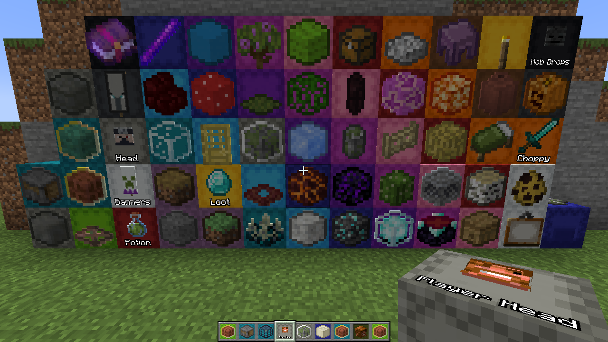
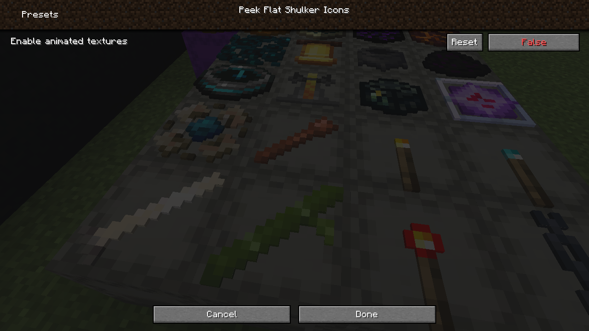
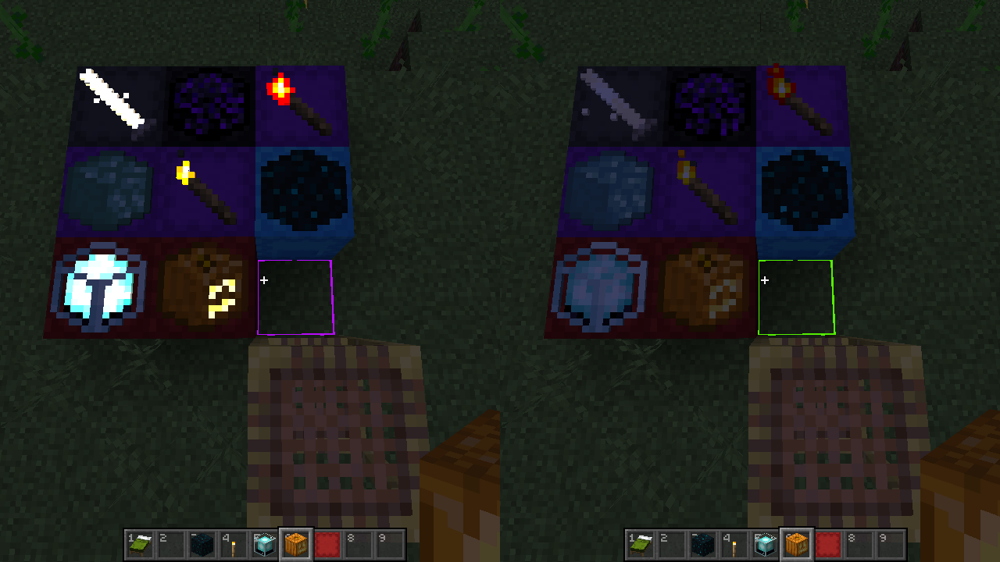

Peek flat shulker icons
=======================

Perfect addition to [Peek](https://www.curseforge.com/minecraft/mc-mods/peek) mod to theme your shulker boxes with a [flat pixelly look](https://github.com/ThePotatoKing55/2D-block-texture-pack)

Features
--------

- Mostly high-quality textures!
- Differentiation between otherwise identical blocks, like a shiny finish on the waxed copper items!
- Neat animations!
- A more cohesive visual style!

Preview
-------

Here's a shot of it in action:

Enabling and disabling parts of the resourcepack with [respackopts](https://www.curseforge.com/minecraft/mc-mods/respackopts)

Alternatively, here's a very long list of every item in the pack (not up to date):

Installation
------------

[Download from GitHub](https://github.com/johndrinkwater/peek-flat/releases/latest) or get it from [CurseForge](https://www.curseforge.com/minecraft/texture-packs/peek-flat-shulker-icons) and download the latest release’s file. Just put it in your `resourcepacks` folder (`%AppData%\.minecraft\resourcepacks` on Windows, `~/Library/Application Support/minecraft/resourcepacks` on macOS, or `~/.minecraft/resourcepacks` on Linux) and apply it in-game.

Feedback
--------

If you find any issues or have suggestions, make a new issue [here](https://github.com/johndrinkwater/peek-flat/issues).

Other Stuff
-----------

This work heavily builds upon https://github.com/ThePotatoKing55/2D-block-texture-pack and https://github.com/Thanos1716/2d-block-item-resourcepack
which were inspired by stiw91's [Flat - 2D Items](https://www.planetminecraft.com/texture-pack/flat-4806298/)

Optional dependency on [Respackopts](https://www.curseforge.com/minecraft/mc-mods/respackopts), which exposes settings to disable animations and emissive textures
